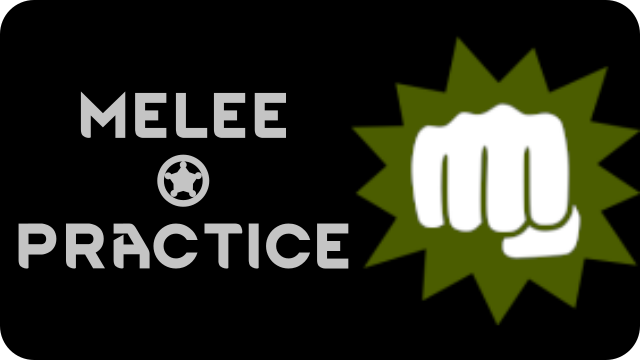

==============
Melee Practice
==============

A quality-of-life mod for Rimworld.

Mark pawns or animals as victims. Mark other pawns as bullies. The bullies will practice their melee skill against the victims on a regular basis.

* Bullies will only melee victims when the victims are fully healed of all non-permanent injuries.

There are mod options in the menu for controlling how much bullying will be done.
